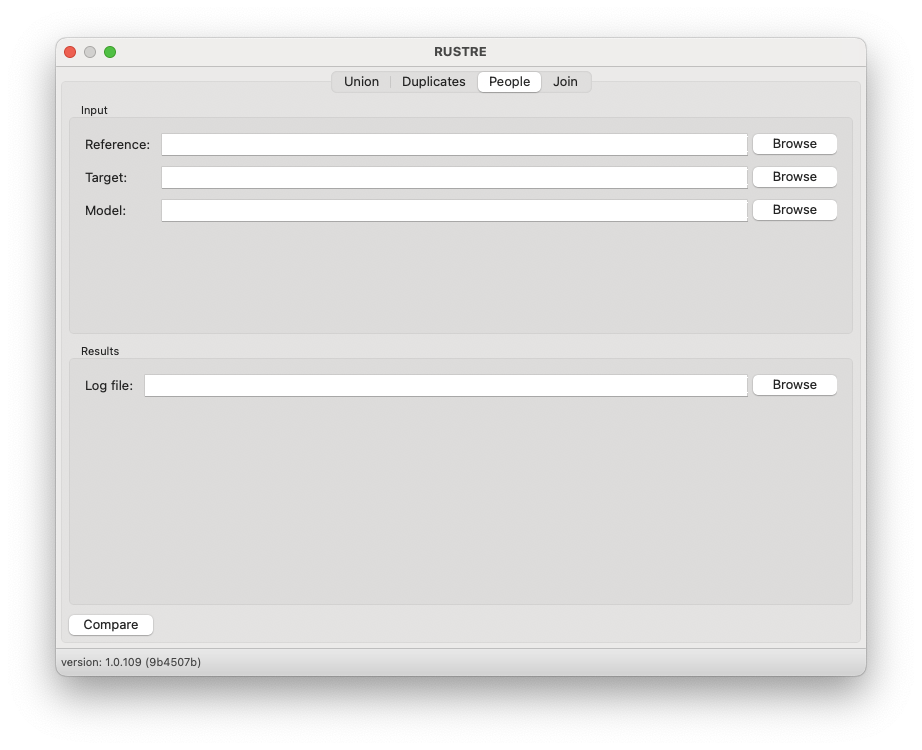

# People

Rustre also allows to compare two xlsx files, a source file and a destination file. 
These two files can have different structures.



The program works as follows: each line of the destination file will be read. 
A unique key will be created (e.g. a mix of name, first name and date of birth). 
Depending on the content the following operations will be performed:

- addition: the unique key does not exist in the source file and the line in the destination file must be added.
- modification : the unique key exists in the source file but the content has changed. The source file must be modified to integrate this new content.
- ignore : some lines in the destination file can be ignored.

All these operations are configurable with a configuration file (.ini).

The ini file structure is described bellow

## Configuration file

To work, "RUSTRE" needs a configuration file (*.ini file) describing the data model. 
The structure of this file is explained below

### Groups
Two identical groups must be present:

- source `[SOURCE]` describe the xlsx source file structure. 
- target `[TARGET]` describe the xlsx target file structure.

:::{Note}  
The source file is the reference. Only this file can be modified according to the values found in the target file
:::

### Values

For each group, the following values are required:

| Option             | Value  | Description                                                                                                                  |
|--------------------|--------|------------------------------------------------------------------------------------------------------------------------------|
| id_col             | list   | the columns used to create an identity (column index is zero based)                                                          |
| skip_col           | number | the index of the column in which to check if the data should be skipped (Zero based index, could be None)                    |
| skip_col_value     | text   | if the parsed cell (in column skip_col) is equal to this value, we ignore the row when parsing the file                      |
| col_compare        | number | The comparison column between source and target files                                                                        |
| col_change_copy    | list   | The columns to copy into source if a change is found (zero based index)                                                      |
| col_change_mapping | list   | A list of replacement values. Each line must contain the following information: the column number followed by a list of values to replace |
| col_copy           | list   | The number of the columns to copy                                                                                            |
| col_join           | list   | The index of columns to be joined                                                                                            |
| col_col_mapping    | list   | A list of replacement values, see col_change_mapping for the structure                                                       |
| col_condition      | list   | Conditional modification of cells. Each row contains the original column, the content to search and the destination column if the content is found                                                                                                                             |
| col_strip_text     | list   | A list with the column to modify and the number of characters to remove                                     |


### Sample


An example of a complete configuration file is available bellow (see also `test/data/test_compare2.ini`)

```ini
[SOURCE]
id_col= 3,2,5
; skip_col =
; skip_col_values =
col_compare = 1
col_change_copy = 15,16
col_change_mapping =
        0,Activ,Inactiv
col_copy = 3,2,5,1
col_join =
        11
        12
col_mapping =
        0,Activ,Inactiv
        4,M,F
        9,Microsoft,Easyjet
        10,Redmond; Washington; USA, London Luton Airport; UK
col_condition =
        7,familly member,8
col_strip_text =
        6,-1

[TARGET]
id_col = 1,2,3
skip_col = 6
skip_col_values =
        Child
col_compare = 7
col_change_copy = 14,13
col_change_mapping =
        7,announced,gone
col_copy = 1,2,3,7
col_join =
        9,8
        10,11
col_mapping =
        7,announced,gone
        4,Male,Female
        0,42,500
        0,42,500
col_condition =
        6,Wife,-1
col_strip_text =
        5,3
```