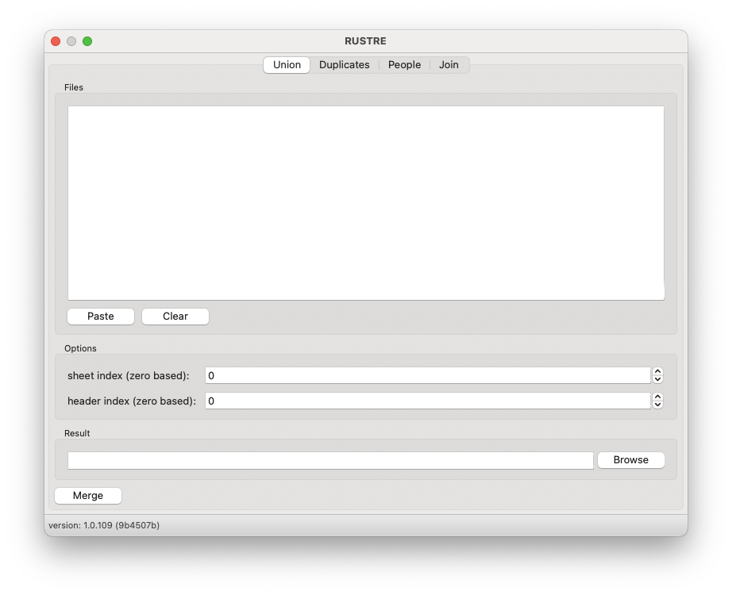

# Union

RUSTRE allows to merge several xlsx workbooks with the same structure. The program checks that the
headers are similar before proceeding with the merge

1. Copy files from your explorer
2. Press the `Paste` button to add files to the list 
3. Set sheet index 

:::{Note}
Sheet index is the zero based number of the workbook's sheet.

Here, Sheet3 has index 2
:::

4. Define which line is the data header

:::{Note}
Header index is the zero based number of header line.

Here, header index is equal to 2
:::

5. Choose a name and path for the merged file
6. Press the `Merge` button
